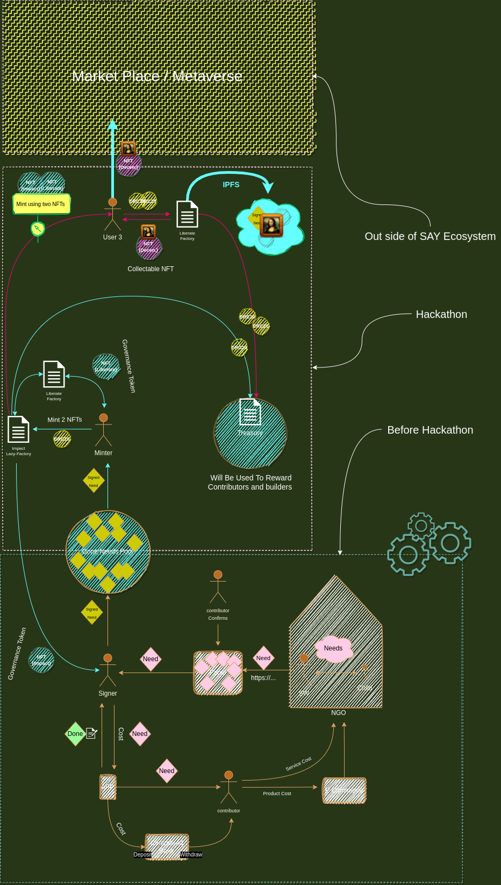

# **How it works:** (Before Hackathon)

- Authorized social workers register children in our app. ( These children are located in NGO/charity/Government camps/Shelters/Orphanages, ...) 

-  Social workers regularly update children's needs from daily requirements such as nutrition to long-term needs such as education.

- Users use SAY APP to register and search for a random child 

- After finding the child, users choose a role: mother, father, aunt, uncle, etc., to adopt them virtually and create/join a virtual family.

- Virtual families use micro-donation to take care of their children's requirements listed by social workers individually or collectively. (They either buy the product from independent online retailers through our app, like buying a jacket or send their donation directly to NGO, i.e. for school transportation)

- virtual families receive confirmation receipts/reports at every step to make everything more transparent.

# **How it works:** (After Hackathon);
Add on top of existing product
- users (virtual families) sign their done needs with Metamask
- a pool of signature with different properties are available to be minted
- user-2 mint signatures (ERC721) and release **TWO** governance token to the associated signer and themselves.
- minter's value will be hold in a treasury (smart contract) for the future DAO
- user 3 can use any two NFT pairs to create a collicteble NGT with a random art created from the signatures and NFT pair.

  - NFT1 (**Impact** - **Governance**) - for taking care of a need 
  - NFT2 (**Liberate** - **Governance**) - for minting and giving moe governance token to the community
  - NFT3 (**Decentralize** - **Collectible**) - upload a portion of the database to IPFS 